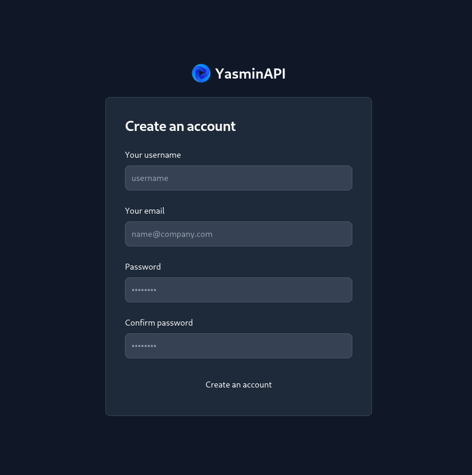
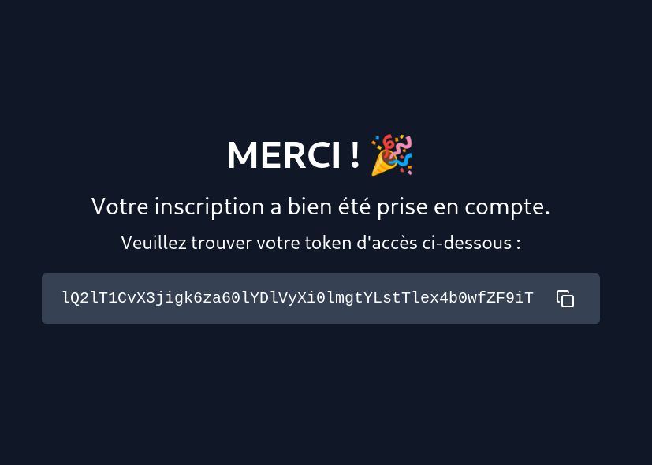

# API Token Inscription

## Lancement du projet

Depuis la racine du projet :

```bash
php -S localhost:8000
```

## Configuration

Créer un fichier `conf/db.ini` et inscrire vos données d'accès à la base de données avec le format suivant :

```ini
DB_HOST=127.0.0.1
DB_PORT=3306
DB_NAME=dbname
DB_CHARSET=utf8mb4
DB_USER=user
DB_PASSWORD=password
```

> [!NOTE]
> Vous pouvez aussi copier le fichier `conf/db.ini.template` vers `conf/db.ini` et personnaliser les valeurs de configuration

## Aperçu




